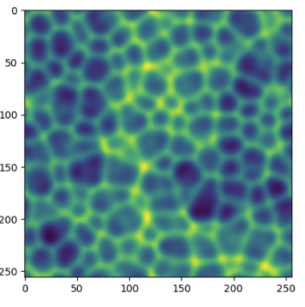

# ForecastingGCNN

  

This repository implements a GCNN to conduct forecasting in the 2D Kuramoto-Shivashinsky dataset.  The model is very simple (just 2 layers). The intention is to provide a basis for more complex models that implement a recurrence relation.

